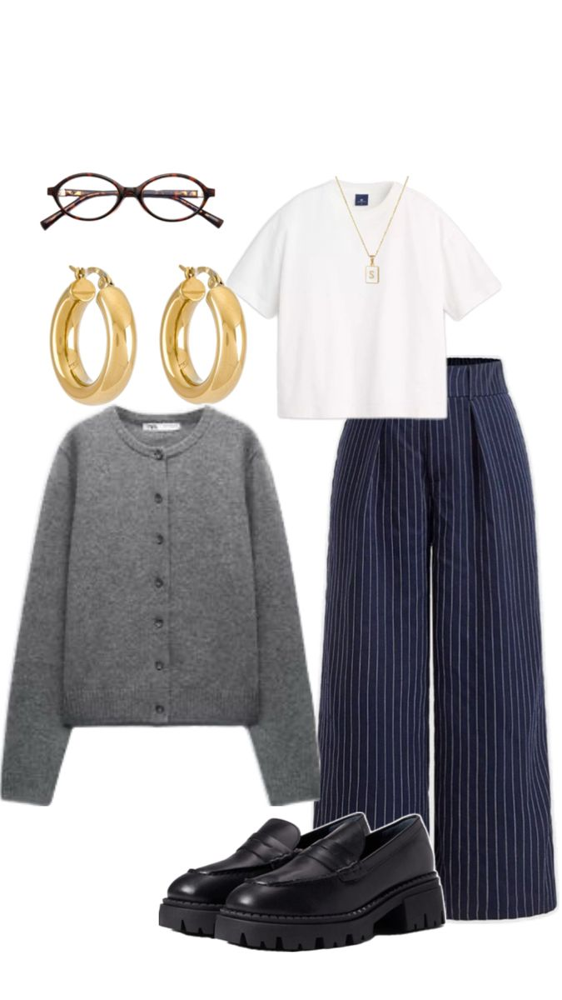
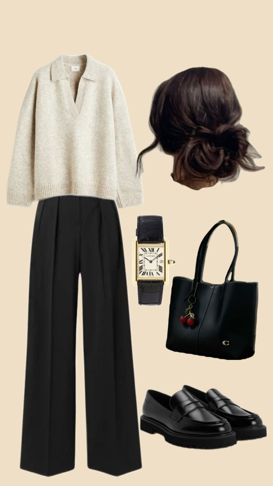

# Building a Workwear Capsule

A workwear capsule is not a closet full of beige clothes. To me, it is a short list of pieces that can do more than one job, so getting dressed is easier and my budget goes further. I would rather own one blazer that works with trousers, jeans on a casual Friday, and a simple dress than buy three pieces that only make one outfit.

## My starting formula

I usually build around two neutral colors, one accent color, and one print. Black and cream feel easy, but navy, chocolate brown, gray, olive, or camel can do the same job. An accent such as burgundy, cobalt, dusty pink, or green keeps the outfits from feeling like a uniform. The goal is for most tops to work with most bottoms without a lot of thinking.

My affordable capsule usually starts with:

- one structured blazer or cardigan
- two comfortable pairs of work pants
- one skirt or easy office dress
- three tops in different necklines
- one pair of walkable flats or loafers
- one simple bag and one small piece of jewelry

### Make every piece earn its space

Before buying, I ask whether a new item works with at least three things I already own. I also think about the days I actually have: commuting, sitting at a desk, presentations, and grabbing coffee after work. This is where the [[fit-and-comfort-checklist|fit and comfort checklist]] matters. A beautiful piece that pinches when I sit is not a good bargain.

The capsule also makes styling less repetitive. I can change the mood with [[color-pairing-for-the-office|color pairing]], add a layer for a cold office with [[layering-for-changing-temperatures|smart layering]], or turn the same base into a [[desk-to-dinner-outfit-formulas|desk-to-dinner outfit]].
