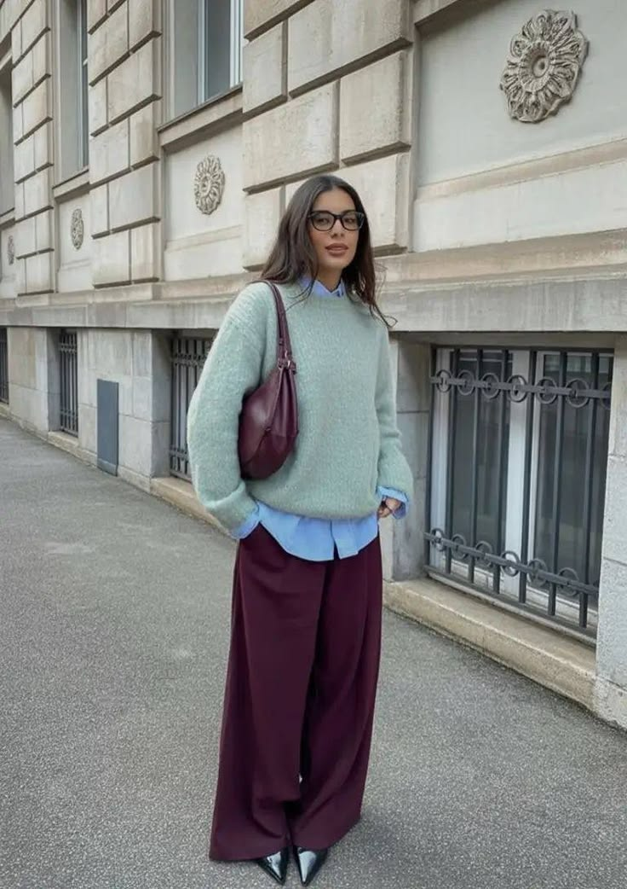
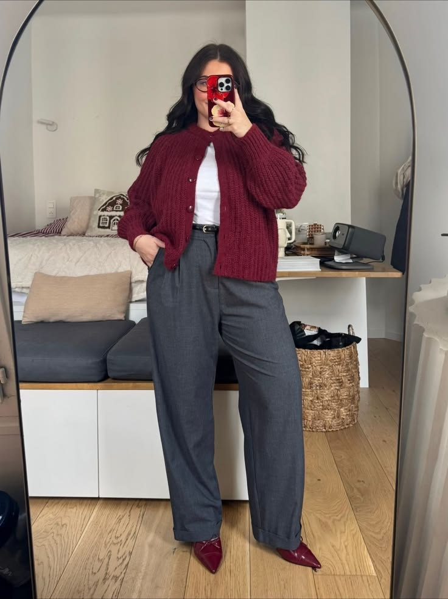

# Building a Workwear Capsule

I like the idea of a workwear capsule because it makes getting dressed feel easier, not more restrictive. It does not mean filling my closet with beige clothes or giving up my personal style. For me, it means choosing a few pieces I can wear in several different ways. That helps me save money and makes busy mornings less stressful. I would much rather have one blazer that works with trousers, jeans on a casual Friday, and a dress than buy three pieces I will only wear once in a while.

## My starting formula

To build one, I usually start with two neutrals, one color I really love, and maybe one print. Black and cream are easy choices, but navy, brown, gray, olive, and camel work just as well. A color like burgundy, cobalt, dusty pink, or green adds personality and keeps the outfits from looking like a uniform. From there, I look for pieces that can mix together easily. If most of my tops work with most of my pants or skirts, I know I have a good starting point.

  
  
  
  

## Office style references

This original flat lay is closer to how I think about affordable office styling: a few versatile basics can create a polished outfit without looking expensive or overly formal. A navy blazer, cream knit, dark trousers, loafers, canvas tote, and burgundy cardigan can be mixed into several looks and added slowly as the budget allows.

![[assets/affordable-office-capsule.png]]

I also saved Imogen Lamport's *5 Step Formula for a Fabulous Wardrobe Even on a Budget* because it is directly about creating a practical wardrobe without overspending. The guide is useful when I want to plan purchases, make the clothes I already own work harder, and build a capsule gradually instead of buying a whole new closet at once.

![[assets/budget-friendly-wardrobe-formula.pdf]]

Here is the simple mix I would start with for an affordable capsule:

- one structured blazer or cardigan
- two comfortable pairs of work pants
- one skirt or easy office dress
- three tops in different necklines
- one pair of walkable flats or loafers
- one simple bag and one small piece of jewelry

### Make every piece earn its space

Once I have an idea of my colors, I ask whether a new item works with at least three things I already own. I also think about what I actually do during the day: commute, sit at my desk, go to meetings, and sometimes grab coffee after work. Those details matter because a cute piece that pinches when I sit is not really a good deal. I use the [[fit-and-comfort-checklist|fit and comfort checklist]] to make sure the clothes feel as good as they look.

The best part is that a small capsule does not have to feel repetitive. I can change the mood with [[color-pairing-for-the-office|color pairing]], add warmth when the office is freezing with [[layering-for-changing-temperatures|smart layering]], or turn the same base into a [[desk-to-dinner-outfit-formulas|desk-to-dinner outfit]]. That is what makes affordable style feel realistic to me: a few thoughtful pieces can still give me plenty of options.
